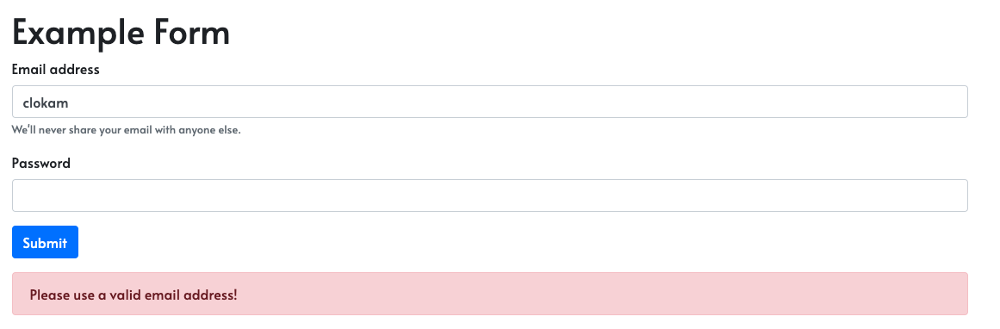

# Web Dev Basics

The following will outline the steps to create a basic web form using HTML, CSS, JavaScript and Bootstrap.

## Create HTML page

Create a basic HTML page. The head contains the title, metadata, scripts, styles and more. The body contains the actual content that shows on the web page.

```html
<head>
  <title>Hello World!</title>
</head>

<body>
  <h1>Heading 1</h1>
</body>
```

## Add Bootstrap

Let us go ahead and add the following Bootstrap libraries to our page. You can get the actual scripts and styles to be added at [getbootstrap.com](https://getbootstrap.com/). 

```html
<link
  rel="stylesheet"
  href="https://stackpath.bootstrapcdn.com/bootstrap/4.5.2/css/bootstrap.min.css"
  integrity="<getbootstrap.com>"
  crossorigin="anonymous"
/>
<link
  href="https://fonts.googleapis.com/css2?family=Alata&display=swap"
  rel="stylesheet"
/>
<script
  src="https://code.jquery.com/jquery-3.5.1.slim.min.js"
  integrity="<getbootstrap.com>"
  crossorigin="anonymous"
></script>
<script
  src="https://cdn.jsdelivr.net/npm/popper.js@1.16.1/dist/umd/popper.min.js"
  integrity="<getbootstrap.com>"
  crossorigin="anonymous"
></script>
<script
  src="https://stackpath.bootstrapcdn.com/bootstrap/4.5.2/js/bootstrap.min.js"
  integrity="<getbootstrap.com>"
  crossorigin="anonymous"
></script>
```

## Add your custom styling 

Add the following to your head and create the **style.css** file as shown below. 

In index.html, 

```html
<link href="style.css" rel="stylesheet">
```

In styles.css, 

```css
h1 {
    color: red
}
```

## Add Google Fonts 

You can get the Google Fonts that you want at [Google Fonts](https://fonts.google.com/)

Add the following in your <head> and then use the font in your **styles.css** file. 

In index.html, 

```html
<link href="https://fonts.googleapis.com/css2?family=Alata&display=swap" rel="stylesheet">
```

In styles.css,

```css
body {
    font-family: "Alata"
}
```

Now all your elements in your page will be styled with the **Alata** font from Google Fonts. 

## Add a form to the page

We can go ahead and add a form to the page as follows, 

Replace the following in your index.html, 

```html
<body>
    <div class="container">
        <h1 class="main-heading">Example Form</h1>
        <form id="loginForm">
            <div class="form-group">
                <label for="email">Email address</label>
                <input type="email" class="form-control" id="email" aria-describedby="emailHelp">
                <small id="emailHelp" class="form-text text-muted">We'll never share your email with anyone
                    else.</small>
            </div>
            <div class="form-group">
                <label for="password">Password</label>
                <input type="password" class="form-control" id="password">
            </div>
            <button type="submit" class="btn btn-primary">Submit</button>
        </form>
        <div id="errorAlert" class="alert alert-danger" role="alert">
            Please use a valid email address!
        </div>
    </div>
</body>
```
And in your **styles.csss** add the following, 

```css
#errorAlert {
    display: none;
}
```

## Add JavaScript for Validation

The final step will be add validation for your form so that users can only submit valid email addresses. 

Create a **validator.js** file in your folder and add the following code, 

```js
const validate = () => {
  let email = document.forms["loginForm"]["email"].value;

  if (email.includes("@miraclesoft.com")) {
    document.getElementById("errorAlert").style.display = "none";
    return true;
  } else {
    document.getElementById("errorAlert").style.display = "block";
    return false;
  }
};
```

Now go into index.html and update your form as follows, 

```html
<form id="loginForm" onsubmit="return validate()" novalidate>
```

And in the your index.html add the following in the head, 

```html
  <script src="validator.js"></script>
```

## Final Code

Your final result should look like the below image, 



Your final code should look as follows, 

**index.html**

```html
<head>
    <title>Hello World Page</title>
    <link rel="stylesheet" href="https://stackpath.bootstrapcdn.com/bootstrap/4.5.2/css/bootstrap.min.css"
        integrity="<getbootstrap.com>" crossorigin="anonymous">
    <link href="style.css" rel="stylesheet">
    <link href="https://fonts.googleapis.com/css2?family=Alata&display=swap" rel="stylesheet">
    <script src="https://code.jquery.com/jquery-3.5.1.slim.min.js"
        integrity="<getbootstrap.com>"
        crossorigin="anonymous"></script>
    <script src="https://cdn.jsdelivr.net/npm/popper.js@1.16.1/dist/umd/popper.min.js"
        integrity="<getbootstrap.com>"
        crossorigin="anonymous"></script>
    <script src="https://stackpath.bootstrapcdn.com/bootstrap/4.5.2/js/bootstrap.min.js"
        integrity="<getbootstrap.com>"
        crossorigin="anonymous"></script>
    <script src="validator.js"></script>

</head>

<body>
    <div class="container">
        <h1 class="main-heading">NHacks Demo Form</h1>
        <form id="loginForm" onsubmit="return validate()" novalidate>
            <div class="form-group">
                <label for="email">Email address</label>
                <input type="email" class="form-control" id="email" aria-describedby="emailHelp">
                <small id="emailHelp" class="form-text text-muted">We'll never share your email with anyone
                    else.</small>
            </div>
            <div class="form-group">
                <label for="password">Password</label>
                <input type="password" class="form-control" id="password">
            </div>
            <button type="submit" class="btn btn-primary">Submit</button>
        </form>
        <div id="errorAlert" class="alert alert-danger" role="alert">
            Please use a valid email address!
        </div>
    </div>
</body>
```

**styles.css**

```css
body {
    font-family: "Alata";
}

.main-heading {
    margin-top: 20px;
}

#errorAlert {
    display: none;
}
```

**validator.js**

```js
const validate = () => {
  let email = document.forms["loginForm"]["email"].value;

  if (email.includes("@miraclesoft.com")) {
    document.getElementById("errorAlert").style.display = "none";
    return true;
  } else {
    document.getElementById("errorAlert").style.display = "block";
    return false;
  }
};
```